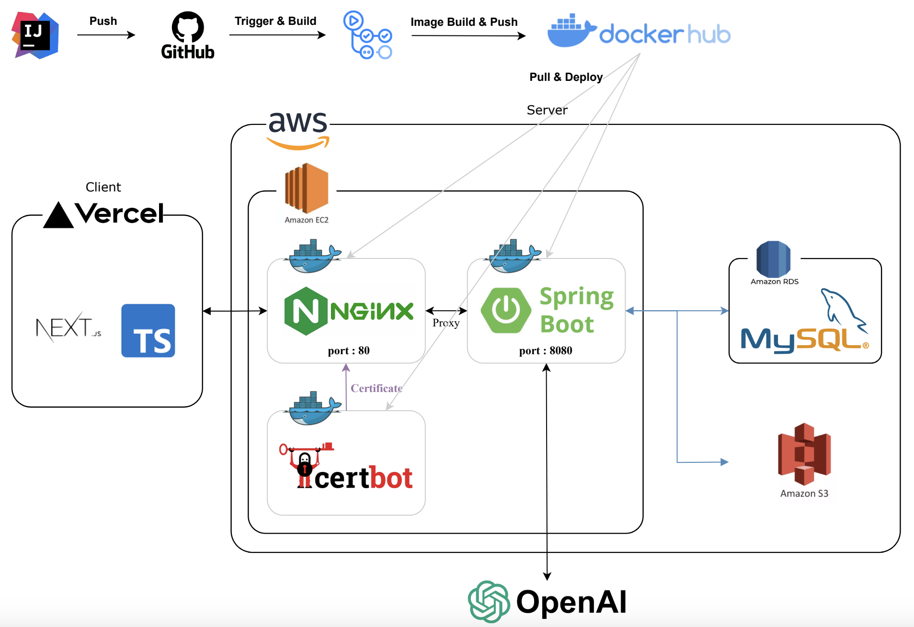
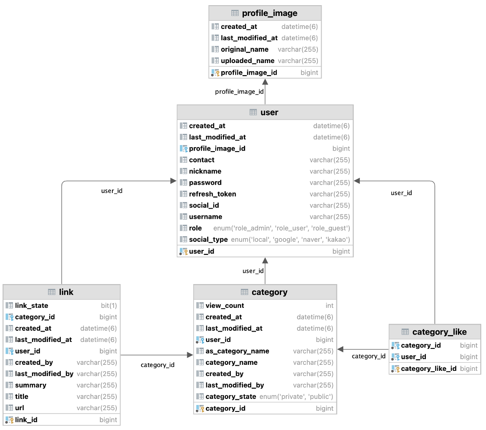
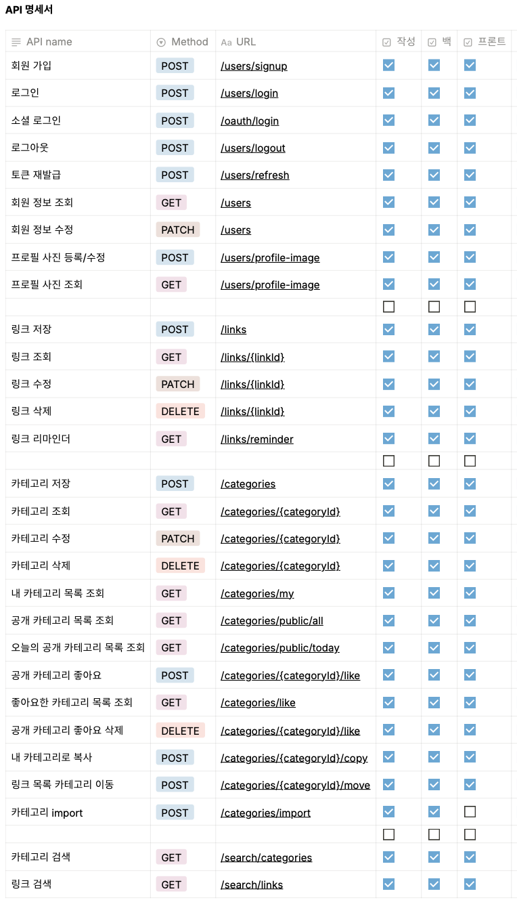

# aDitory

> **링크 자동 분류 웹 서비스** <br/>


## 배포 주소
> **프론트 서버** : https://aditory.vercel.app <br/>
> **백엔드 서버** : https://api.aditory.site <br/>

## 프로젝트 소개
> aDitory (어디토리) 는 '링크 자동 분류 웹 서비스' 입니다. <br/>
> 링크를 복사해서 붙여넣기만 하면 자동으로 이를 분석하고 적절한 카테고리로 분류해주는 기능을 제공합니다.

## 🛠️ 개발 환경
| 통합 개발 환경                 | IntelliJ                                   |
|--------------------------|-----------------------------------------------|
| 배포                       | AWS EC2(Ubuntu)                              |
| Database                 | AWS RDS(MySQL)                                |
| Spring Version           | 3.2.4                                         |
| Project Build Management | Gradle                                        |
| CI/CD Process            | Github Actions, Docker Compose                |
| ERD Diagram              | ERD Cloud, IntelliJ                           |
| API Document             | Notion                                        |
| Java version             | Java 17                                       |
| File Upload              | AWS S3                                        |
| ETC                      | Spring Data JPA, Spring Security, OAuth2      |

<br/>

## 🔧 System Architecture


## ☁️ ERD


## 📄 API 명세서



## 시작 가이드
### Requirements
For building and running the application you need:

- Java Development Kit (JDK) 17
- Spring Boot 3.2.4
- MySQL 8.0.35

### Installation
```bash
$ git clone https://github.com/googongill/aditory-back
$ cd aditory-back
```
### Run Server 
```
$ ./gradlew bootJar
$ ./gradlew bootRun
```
You can use .jar file to run server either in the foreground
```
$ java -jar JARFILE.jar
```
or in Daemon
```
$ nohup java -jar JARFILE.jar &
```

